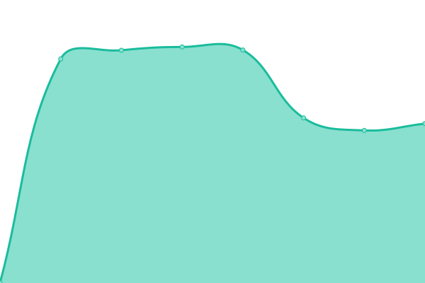

# [📈 Live Status](https://status.granger.dog): <!--live status--> **🟩 All systems operational**

This repository contains the open-source uptime monitor and status page for [Yoëll Zuidweg](granger.dog), powered by [Upptime](https://github.com/upptime/upptime).

With [Upptime](https://upptime.js.org), you can get your own unlimited and free uptime monitor and status page, powered entirely by a GitHub repository. We use [Issues](https://github.com/GrangerTheDog/StatusMonitor/issues) as incident reports, [Actions](https://github.com/GrangerTheDog/StatusMonitor/actions) as uptime monitors, and [Pages](https://status.granger.dog) for the status page.

<!--start: status pages-->
<!-- This summary is generated by Upptime (https://github.com/upptime/upptime) -->
<!-- Do not edit this manually, your changes will be overwritten -->
<!-- prettier-ignore -->
| URL | Status | History | Response Time | Uptime |
| --- | ------ | ------- | ------------- | ------ |
|  [Granger.dog Main page](https://granger.dog) | 🟩 Up | [granger-dog-main-page.yml](https://github.com/GrangerTheDog/StatusMonitor/commits/HEAD/history/granger-dog-main-page.yml) | 

 675ms
     
 | 

<a href="https://status.granger.dog/history/granger-dog-main-page">100.00%</a>
    

|  [GrangerHosting (Panel)](https://panel.granger.dog) | 🟩 Up | [granger-hosting-panel.yml](https://github.com/GrangerTheDog/StatusMonitor/commits/HEAD/history/granger-hosting-panel.yml) | 

 1036ms
     
 | 

<a href="https://status.granger.dog/history/granger-hosting-panel">100.00%</a>
    

|  [GrangerHosting (Node 1)](https://node1.granger.dog:8080/) | 🟩 Up | [granger-hosting-node-1.yml](https://github.com/GrangerTheDog/StatusMonitor/commits/HEAD/history/granger-hosting-node-1.yml) | 

 588ms
     
 | 

<a href="https://status.granger.dog/history/granger-hosting-node-1">100.00%</a>
    

|  [FurryFusion MC](mc.furryfusion.nl) | 🟩 Up | [furry-fusion-mc.yml](https://github.com/GrangerTheDog/StatusMonitor/commits/HEAD/history/furry-fusion-mc.yml) | 

 134ms
     
 | 

<a href="https://status.granger.dog/history/furry-fusion-mc">99.72%</a>
    

<!--end: status pages-->

[**Visit our status website →**](https://status.granger.dog)

## 📄 License

- Powered by: [Upptime](https://github.com/upptime/upptime)
- Code: [MIT](./LICENSE) © [Anand Chowdhary](https://anandchowdhary.com), supported by [Pabio](https://pabio.com)
- Data in the `./history` directory: [Open Database License](https://opendatacommons.org/licenses/odbl/1-0/)
